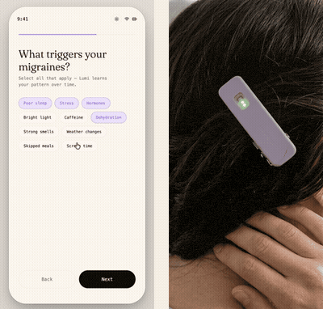

# Lumi — Companion App Prototype

**Your body knows before you do.**

[Live Prototype](https://lumi-wearable.vercel.app) · [Case Study](https://lumi-case-study.vercel.app)

---



---

## What This Is

A fully interactive mobile UI prototype for Lumi — a speculative wearable biosensor designed to detect the migraine prodrome window before an attack begins. This repo is the companion app: the screen you'd check when your Aura clip picks up a signal shift.

No real hardware connection. All biosensor data is simulated to demonstrate the complete interaction model.

---

## Screens

| Screen                  | What it does                                                                                                   |
| ----------------------- | -------------------------------------------------------------------------------------------------------------- |
| **Onboarding**          | Device pairing flow, baseline calibration                                                                      |
| **Dashboard**           | Live signal orb (calm / medium / warning), vitals at a glance — HRV, temp, stress, sleep, hydration, cycle day |
| **Early Warning Alert** | Triggered when risk rises — step-by-step action checklist with micro-interactions and a progress bar           |
| **Patterns Calendar**   | Tap any two days to compare biosensor data side by side                                                        |
| **Symptom Log**         | Categorized entry (hormonal, lifestyle, aura, attack) — tag auto-derived from symptoms selected                |

---

## Tech Stack

- **React + TypeScript** — component architecture and type safety
- **Vite** — build tooling
- **Vercel** — deployment
- **Vanilla CSS** — no UI framework; all styles hand-rolled
- **Fraunces** — serif display typeface
- **Departure Mono** — monospace for data readouts
- **Lucide Icons** — iconography
- Simulated biosensor data via local state

---

## Running Locally

```bash
git clone https://github.com/yafira/lumi-app
cd lumi-app
npm install
npm run dev
```

Open [http://localhost:5173](http://localhost:5173)

---

## Design Notes

This app was designed in the browser, not before it. No Figma handoff — every screen was built, viewed, adjusted, and rebuilt in code. A few decisions worth noting:

- **The signal orb** went through dozens of iterations for breathing animation, color states, and glow intensity. It needed to feel alive without being distracting — something only apparent when watching it pulse in the actual interface.
- **The alert flow** was designed through interaction: scale animations, confirmation labels, and the progress bar all emerged from asking what each tap needed to feel like before the success state made sense.
- **The symptom log** originally had two overlapping inputs — a tag selector and a symptom picker. Watching it in the interface made the redundancy obvious; the tag is now auto-derived from symptoms selected, cutting the interaction in half.

---

## Part of

This prototype is one piece of the Lumi project — a speculative wearable system including the Aura hair clip, Halo headband, and Nimbus adhesive patch. All hardware is a design concept; see the [case study](https://lumi-case-study.vercel.app) for the full picture.

---

## About

A design engineering project by [Yafira Martinez](https://yafira.xyz)

[Portfolio](https://yafira.xyz) · [Contact](mailto:yafira@proton.me)
